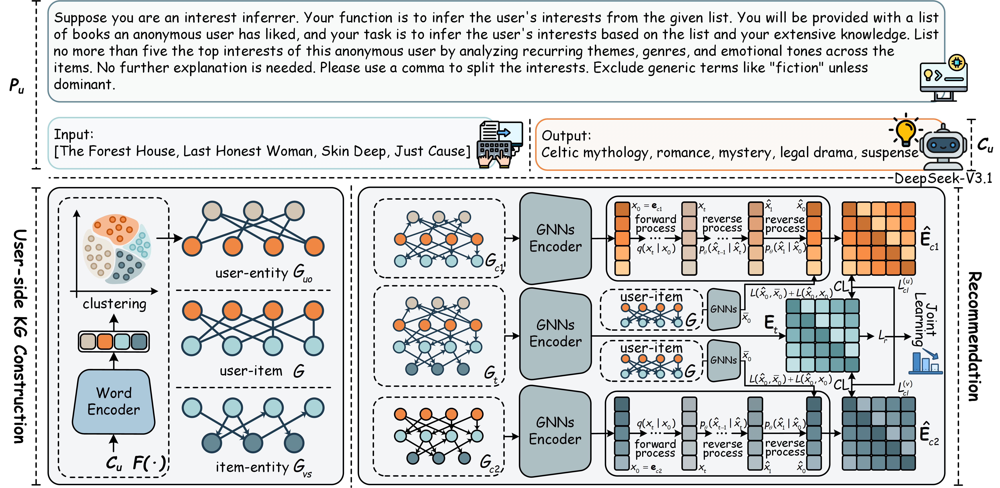

# SEDIRec: Large Language Models-Enhanced Semantic Diffusion for User-Centric Recommendation
This is the Torch implementation for our proposed SEDIRec.



## Introduction
Recently, knowledge graphs have been utilised in recommendation systems to improve accuracy by integrating item-side auxiliary information.
However, structural user-side knowledge is difficult to construct and integrate due to inherent scarcity and improper granularity.
This paper introduces a graph contrastive learning with Semantic Transitions-Enhanced DIffusion architecture based on Large Language Models (LLMs) for user-side knowledge-aware Recommendation (SEDIRec).
Specifically, our SEDIRec first leverages LLMs to infer user interests from historical behaviors, integrating this user-side information with item-side and collaborative data to construct main views. Then, two contrastive views are generated using diffusion models with semantic transitions: one at the user-side level and the other at the item-side level. For both contrastive views, we integrate user-side or item-side information with collaborative data to generate a user-item graph. Subsequently, each user-item graph is individually transformed into collaborative data spaces via diffusion models for generating contrastive views. This procedure not only enhances the alignment between user/item-side information and the semantic spaces of collaborative data but also effectively eliminates noise. Extensive experiments on three datasets reveal the superiority of our SEDIRec, especially for users with sparse interactions.

## Environment Requirement
Our experiments are conducted on Linux server with 40G A100. The code has been tested under Python 3.8. The required packages are as follows:

* torch == 1.13.1
* torch-geometric == 2.3.1
* gensim == 4.3.3
* scikit-learn == 1.0.2
* hdbscan == 0.8.40
* sentence-trainsformers == 3.0.0
* prettytable == 3.10.0
* nltk == 3.8.1

## Quick Start
* To run the code:
```
python -u train.py --dataset book-crossing
```

This conmand will read the best hyperparameter setting of the corresponding dataset from `config` folder and languch the training process.

## Details of Important Files
The following outlines the structure of the repository and provides a brief explanation of each file or folder:

* `User_Interest_Generation_BatchMode.py`: Prepare files for the LLM to help DeepSeek infer the user's interests.
* `Structration_User_Knowledge.py`: Encode and cluster user interests from the DeepSeek output.
* `train.py`: Train and evaluate the SEDIRec.
* `LLM.py`: Use large language models to generate user interests.
* `LLM_check.py`: Check and correct errors in content generated by DeepSeek.
* `Denoise_Model.py`: Diffusion models for denoising.

## Dataset
* `train.txt/valid.txt/test.txt`: Preprocessed user-item interactions.
* `xx_list.txt`: Original ID - Remap ID projection file.
* `kg_final.txt`: The Knowledge graph.
* `user_interest_clustered.txt`: User interest graph from encoding and clustering DeepSeek's output.

## Data Generation
To generate user interests independently, please follow the procedural steps outlined below: 

* `User_Interest_Generation_BatchMode.py`: Run User_Interest_Generation_BatchMode.py to generate batch_input data.
* `LLM.py`: Run LLM.py to generate user interests with DeepSeek.
* `LLM_check.py`: Run LLM_check.py to check and fix LLM.py errors caused by network issues.
* `Structration_User_Knowledge.py`: Run Structration_User_Knowledge.py to generate the user interest knowledge graph.
